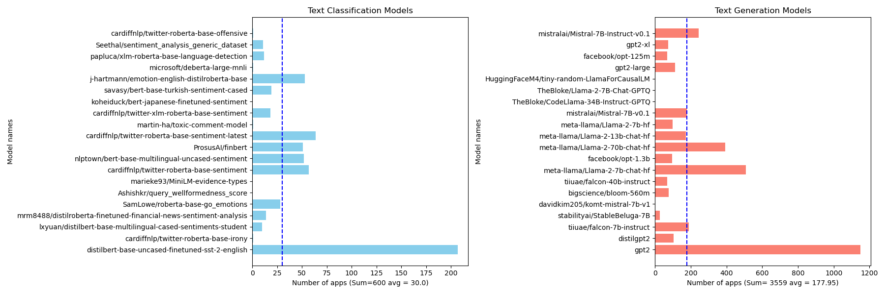
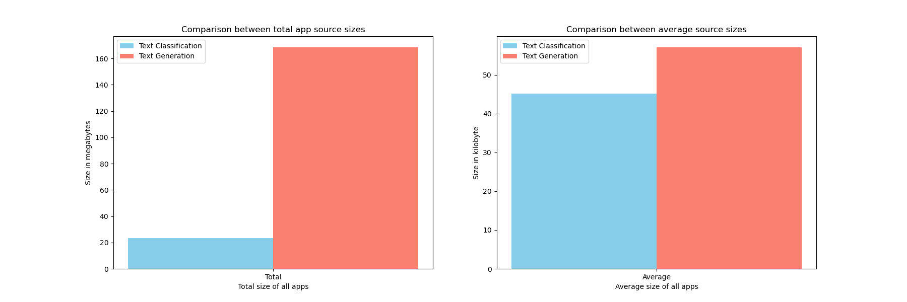

# Text classification models vs text generation models

## Task description:

You're interested in studying machine learning (ML) apps hosted on the https://huggingface.co/spaces ML store. In particular, you want to understand whether "Text Classification" ML models are easier to use by software developers than "Text Generation" ML models, where the term "easier" refers to "requiring less effort for coding or maintenance".

For this analysis, you first need to:

1. obtain a list of the top-20 "Text Classification" and top-20 "Text Generation" models on https://huggingface.co/, ranked based on popularity
2. obtain and compare the number of ML apps ("spaces") for each "Text Classification" and "Text Generation" model obtained in step 1
3. obtain and compare the source code size of the ML apps ("spaces") obtained in step 2 (HINT: check the "Files" tab at the top-right of a given space's page)
4. analyze your results of the previous steps in order to confirm or reject the claim 'it is easier to develop ML applications using "Text Classification" models than applications using "Text Generation" models'
5. what other analysis could be useful to add? (no need to do this analysis now, just motivate/explain relevant future analysis)

---

# This file is to collect the data, compare and storing it in csv files ; following are my steps to complete the task

- step 1 : collecting the 20 text classification and text generation models data ( name ,type ,updated date, downloaded , liked) [ for popularity I assumed more downloaded is more popular ]
- step 2 : collecting the app counts associated with the models obtained in the step 1 and compare them
- step 3 : collecting the source code size of the apps found in the step 3 and compare them
- step 4 : clearning data ( duplicate removing )
- step 5 : Merging all the previously obtained data in to a single csv for each classification and generation model.
- step 6 : Give the analysis result
- step 7 : propose further what other analysis could be useful to add

## Method :

- Language : Python
- Environment : jupyter lab (with virtual environment)
- Data collection : Used web scrapping using BeautifulSoup
- Data process : Pandas
- Analyses Used : Compared the total and mean of the collected app count and app source code size

## Result

The above image shows that:

1. Text Classification Mode
   1. Total app = 600
   1. Average app =30.0
1. Text Generation Model
   1. Total app = 3559
   1. Average app = 177.95

**Difference between the total app** = ( total text generation model apps - total text classification model apps ) = 2959

**Difference between the total app** =(average text generation model apps - Average text classification model apps ) = 147.95

**Text generation models surpass text classification models in total app count, making them the winner in this aspect**

**Above image shows that the text generation models average source code size is a bit higher compare to text classification**

## Result of my analysis

Even though the average source code size of text generation models is higher than that of text classification models for ML application development, the number of apps developed for text generation models is significantly greater. That is why I claim that :

### It is easier to develop ML applications using "Text Generation" models than applications using "Text Classification" models based on above analysis

_Despite the higher average source code size, the number of applications developed using text generation models is much higher, indicating that the ease of development may not be solely determined by the source code size._

There need further other analysis could be useful to add to confirm or reject the claim 'it is easier to develop ML applications using "Text Classification" models than applications using "Text Generation" models.

Some other anlaysis that could be useful to add are as follow :

1. **Training and Inference Resources:** Analyze the computational resources such as CPU time, memory requirements, and training time for both types of models. This will provide insights into the practical aspects of model development and deployment.
2. **Fine-Tuning Requirements:** Quantify the effort required for fine-tuning pre-trained models for "Text Classification" and "Text Generation" tasks. This can provide insights into the adaptability of models to specific domains.
3. **Total time to deploy an app** : The duration needed to deploy an app from the initial stage can indicate which model type is easier to use for developing ML applications.
4. **Developer Surveys and Feedback:** Consider gathering feedback and insights from developers and researchers who have hands-on experience with building and deploying "Text Classification" and "Text Generation" models. This qualitative data can provide valuable perspectives on the ease of development.
